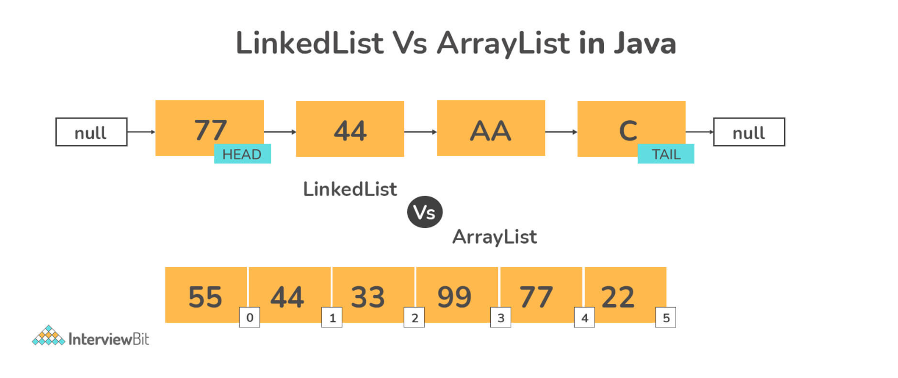
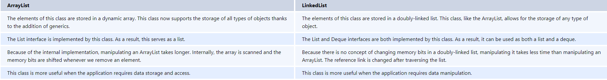
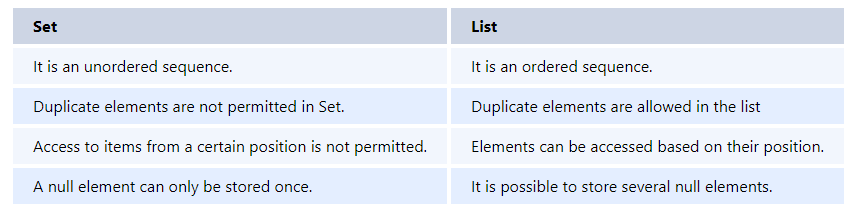
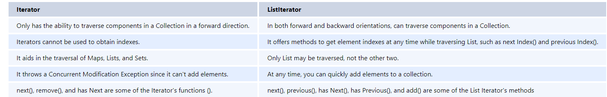
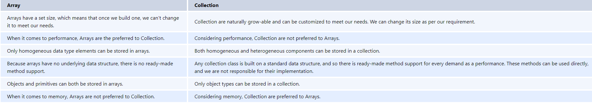
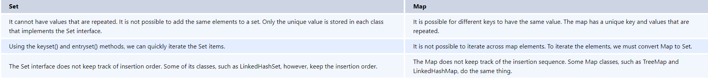
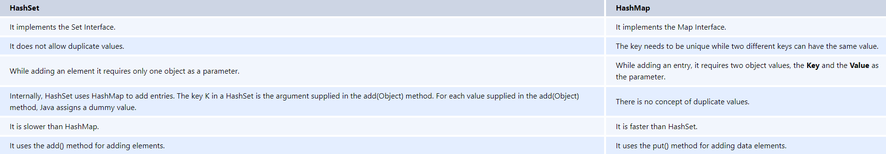

Reviewer Comments: The justification was poor as it failed to explain the tool, function, and parameter ratings and the fulfillment ratings of both responses by providing evidence-based reasoning.
The justification should mention the exact parameters and values used by both responses and provide reasoning for them.

Difference between Collection and collections in the context of Java

Collection: In the java.util.package, there is an interface called a collection. It's used
to represen a collection of separate objects as a single entity. The collection framework's
root interface is referred to as the collection. It has a number of classes and interfaces
for representing a collection of individual objects as a single unit. The key sub-interface
of the collection interface are List, Set, and Queue. Although the map interface is a part
of the Java collection framework, it does not inherit the interface's collection. 
The Collection interface's most significant functions are add(), remove(), clear(), size() and contains().

Collections: the java.util.package has a utility class called Collections. It defines various
utility methods for working with collections, such as sorting and searching. All of
the methods are static. These techniques give developers much-needed voncenience, allowing them to
interact with Collection Framework more succesfully. It provides methods like sort()
to sort the collection elements in the normal sorting order, and min() and max() to get the minimum
and maximum value in the collection elements respectively.

Advantages of the Collection framework

Consistent API: The API has a core set of interfaces like Collection, Set, List, or Map, and all the classes (ArrayList, LinkedList, Vector, and so on) that implement these interfaces have some common set of methods.

Improves program speed and quality by offering high-performance implementations of useful data structures and algorithms, as the programmer does not have to worry about the optimum implementation of a certain data structure in this scenario. They can simply use the best implementation to improve the performance of their program significantly.

Difference between ArrayList and LinkedList.

Differentiate between List and Set in Java.

The List interface is used to keep track of an ordered collection. It is the Collection's child interface. It is an ordered collection of objects that allows for the storage of duplicate values. The insertion order is preserved in a list, which enables positional access and element insertion. 

The set interface is part of java.util package and extends the Collection interface. It is an unordered collection of objects in which duplicate values cannot be stored. It's an interface for using the mathematical set. This interface inherits the Collection interface's methods and adds a feature that prevents duplicate elements from being inserted.

Differentiate between Iterator and ListIterator in Java.

What is the difference between Array and Collection in java?

Array and Collection are equivalent in terms of storing object references and manipulating data, but they differ in a number of ways. The following are the primary distinctions between an array and a Collection:

Can you add a null element into a TreeSet or HashSet?

We can add null elements in a HashSet but we cannot add null elements in a TreeSet. The reason is that TreeSet uses the compareTo() method for comparing and it throws a NullPointerException when it encounters a null element.

Differentiate between Set and Map in Java.

The Set interface is provided by the Java.util package. The set interface is established by extending the collection interface. We can't add the same element to it since it won't let us. Because it contains elements in a sorted order, it does not keep the insertion order. The Set interface in Java is used to build the mathematical Set.

Map is similar to Set in that it is used to store a collection of objects as a single entity. A key-value pair is used to store each object. Because each value is associated with a unique key, we can quickly obtain the value using just the key.

Differentiate between HashSet and HashMap.

HashSet is a Set Interface implementation that does not allow duplicate values. The essential point is that objects stored in HashSet must override equals() and hashCode() methods to ensure that no duplicate values are stored in our set.

HashMap is a Map Interface implementation that maps a key to a value. In a map, duplicate keys are not permitted.

Differentiate between Array and ArrayList in Java.

Java provides arrays as a fundamental functionality. ArrayList is a component of Java's collection system. As a result, It is used to access array members, while ArrayList provides a set of methods for accessing and modifying components.
ArrayList is not a fixed-size data structure, but Array is. When creating an ArrayList object, there is no need to provide its size. Even if we set a maximum capacity, we can add more parts afterward.
Arrays can include both primitive data types and class objects, depending on the array's definition. ArrayList, on the other hand, only accepts object entries and not primitive data types. Note that when we use arraylist.add(1);, the primitive int data type is converted to an Integer object.
Many other operations, such as indexOf() and delete(), are supported by Java ArrayList. Arrays do not support these functions.
