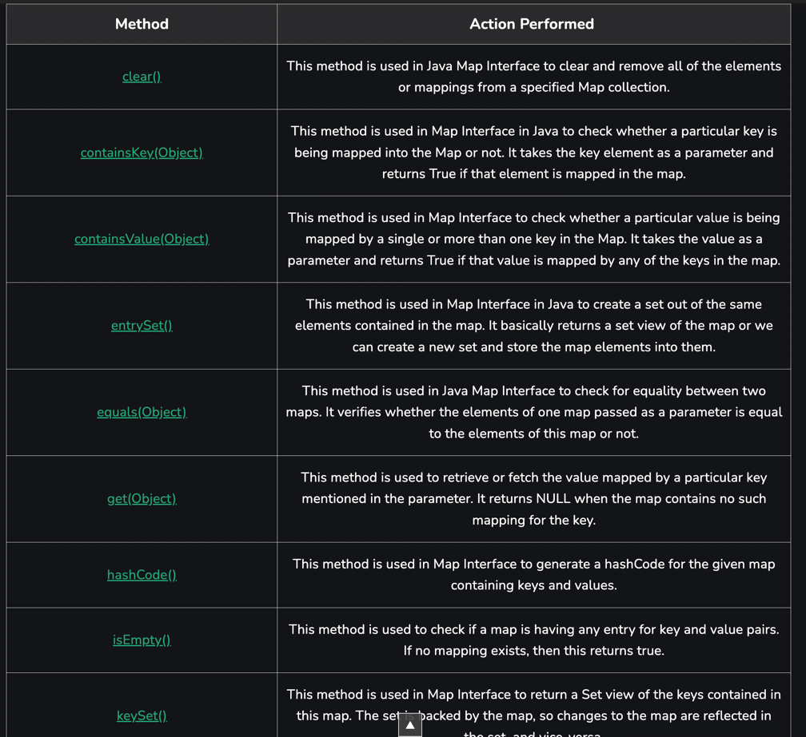
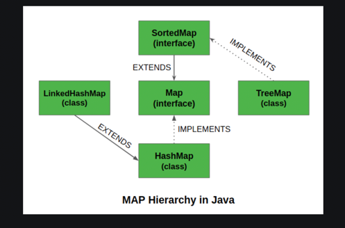

the Map is an interface and the HashMap is an implementation of it.
Often used like this:
Map<Object, Object> hashmap = new HashMap<>();

It has a key, value pair and important to know that the key is unique cant me multiple in a hashmap.
the key value types must be Object classes and cant be primitive.
We use the .put method to add a new key value pair to the map but it has several inner methods
like .containskey .entryset and others.
It has 3 classes: HashMap, TreeMap and LinkedHashMap

methods:

LinkedHashMap: same as HashMap but the insertions in order!!

https://www.geeksforgeeks.org/map-interface-java-examples/
