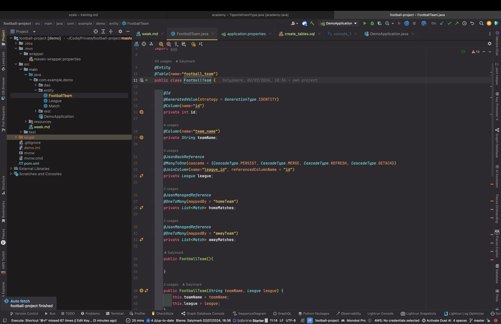

Match: JSONBACK , JSONBACK
League: @JsonManagedReference
footballteam: jsonback, jsonmanage, jsonmanage

Football League project

First of all i created three java classes/domain: FootballTeam, League, Match
Domain: In software engineering, domain is the targeted subject area of a computer program.

FootballTeam class
The class has two annotation Entity and Table which refrerence to the database name.

The fields are defined based on the database schema of the table and all of them has a 
Column annotation which references to the related database name
There is an id and a teamName the id has a generated value annotation because it is autoincremented.

There are some other fields in the footballteam class one of is league
which has a ManyToOne annotation which references to the League class based on the id.
Here we use JoinColumn annotation to reference to the related column in the database
but it has a connection to another table.
It means that more teams could be in on league.

The footballteam class has two other fields homeMatches and awayMatches both of them a list type of Match
Both of them has a OneToMany annotation which references to the Match class fields (homeTeam and awayTeam)
It means that one team has more matches.
At the JoinColumn annotation in the parameter i used mappedby which reference to the Match table field.

Match class
It has the following fields id, hometeam, awayteam, hometeam score and awayteamscore
The id is the same as in the footballteam class it is an autogenerated.
The homeTeam and awayTeam fields has a ManyToOne annotation which references to the Footballteam class
because as i mentioned earlier one team has more matches.
it also has a hometeamscore and awayteamscore field which shows the result of the related match.

League class
the league class has three fields:
id, leaguename and footballteams
the id is the same as in the other classes it is an autogenerated field.
The footballTeams field has a OneToMany annotation which references to the footballteam class 
league field which means that one league has a lot teams.

DAO and DAOImpl
I created DAO interfaces for all the related classes and initialized the CRUD methods

TeamDAOImpl 
It implements the TeamDAO interface and annotated with Repository
In the class i initialized a field entitymanager and in the crud methods i implement the necessary logic

RestControllers
I create restcontrollers for all the classes (league, footballteam, match)
All of them annotated with Restcontroller and RequestMapping and i defined the path of the 
related controller.
For the crud operations i created Get, Put, Post and DeleteMappings with uniqe paths

footbalteam
@JsonBackReference
@JsonManagedReference
@JsonManagedReference

league
@JsonManagedReference
@JsonManagedReference

match
@JsonBackReference
@JsonBackReference
@JsonBackReference
@JsonManagedReference

match2
@JsonBackReference
@JsonBackReference

matchstatistics
@JsonBackReference

POST MATCH STATISTICS

POST http://localhost:8080/api/statistics/save/7
Content-Type: application/json

{
"yellowCards": 7,
"redCards": 0,
"corners": 6,
"homePossession": 37,
"awayPossession": 63
}